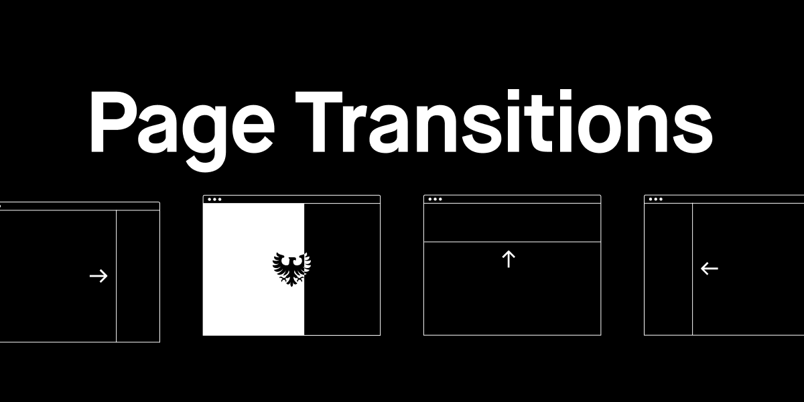

# Page Transitions Using CSS Animations

## Context
Animations on a website can elevate the user experience and demonstrate your prowess as a developer. Landing pages for a development/tech company and developer portfolios often showcase various types of animations on a scroll, click, or hover. Frequently, such sites will also execute an animation when the user navigates to a new page. Such an animation is called a page transition.

### Examples
Below are a few examples of advanced page transitions:
- [artefact.webflow.io](https://artefact.webflow.io/)
- [refokus.com](https://www.refokus.com/)
- [bazil.fr](https://en.bazil.fr/)

This site provides a nice menu that takes you through some more simple page transitions:
- [minimal-page-transitions.webflow.io](https://minimal-page-transitions.webflow.io/)

## Set Up
- Fork and clone this repository
- Open `DLVR-Page-Animations/transition-site` in VS Code
- Open any one of the HTML files in the browser using Live Server 

## Your Task
- You've been given the starter code to a website with 8 unique HTML pages that all have the same `<nav>` bar and stylesheet
- Each page's `<body>` element has a unqiue id, indicative of the animation you will build
- Using the CSS file (`styles/main.css`) create animations for each page's `<body>` element - the animations should run when the page is loaded
- The first page transition has been done for you

## Explanation of Animation Names
1. **Fade In:** The page will fade in from black
1. **Left Slide:** The page will slide in from the left side of the screen
1. **Right Slide:** The page will slide in from the right side of the screen
1. **Top Slide:** The page will slide in from the top of the screen
1. **Bottom Slide:** The page will slide in from the bottom of the screen
1. **Diagonal Slide:** The page will slide in from a corner of the screen. You may choose which corner it slides in from.
1. **Fade In & Diagonal Slide:** The page will slide in from a corner of the screen. You may choose which corner it slides in from. As it slides in, the page will also fade in from black.
1. **Grow:** The page will grow from nothing.
    
    HINT: Maybe your page starts with no dimensions...
